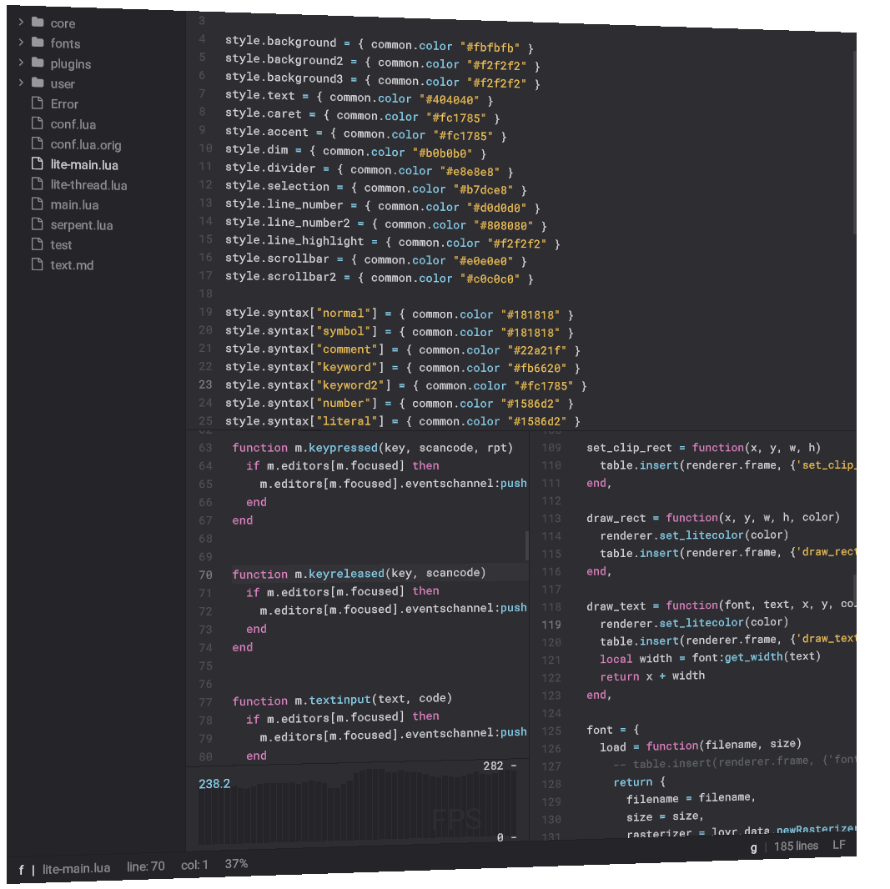

# lite-lovr


A lightweight text editor written in Lua and hosted on LÖVR platform

* **[Original editor code](https://github.com/rxi/lite)**
* **[LÖVR framework](https://github.com/bjornbytes/lovr)**
* **[Plugins](https://github.com/rxi/lite-plugins)**
* **[Color themes](https://github.com/rxi/lite-colors)**

## Overview

*lite* is a lightweight text editor written in Lua — it aims to provide something practical, pretty, *small* and fast, implemented as simply as possible; easy to modify and extend, or to use without doing either.

This fork adapts the *lite* editor to run within the LÖVR framework. LÖVR is a cross-platform framework for 3D and VR games and applications development.

*lite* strikes amazing balance between many features and simplicity of design. LÖVR provides a thin and well-designed layer over HW. This fork is motivated to combine the two into a dynamic 3D/VR/AR programming environment.


## Running

Obtain the [nightly version](https://lovr.org/downloads) of LOVR framework and use it to execute the `lite-lovr` project:

```sh
cd src
lovr .
```

Note that LOVR apps are only supposed to write data into their save directory. Any file saved in the editor will end up there. See notes section in [LOVR docs](https://lovr.org/docs/lovr.filesystem).

## Project status

At this point, all of *lite* editor core works as expected: keyboard controls, opening/editing/saving text documents, managing tabs and panes, command palette, fonts, plugin support, color styles. Everything I tested on *lite* side seems to work ok.

The integration with LOVR is still work in progress. There is no support for mouse or VR controllers at the moment. It is possible to spawn and use two or more editors, but currently they are spawned and positioned through code only.

The filesystem integration is biggest usability problem - users have to be aware of the LOVR save directory and its precedence to be able to use the editor.

There are also some rendering glitches, they don't affect the editor functions.

## Threaded execution

The code of *lite* editor runs within a LOVR thread. This is done to isolate its execution from user project running on main thread, and to allow multiple *lite* instances. Each instance spawns a background thread with running a *lite* instance. LOVR threads are completely separate Lua environments which effectively sandbox the *lite* editor code, and any running plugins. 

*lite* runs its own update loop. When it decides that redrawing is needed (for example when caret needs to blink), it will draw all it's visible views. Requests for drawing are collected into a frame, which is just a list of *lite* draw commands. When frame is fully composed it is serialized and sent to the host thread, which alone can access the `lovr.graphics` functions. The host thread collects frames from all *lite* instances. When drawing the editor instance, each draw command in frame is interpreted as one or more LOVR draw calls.

## Communicating events

The host opens up two uni-directional channels for each editor instance. They are used to communicate both the *lite* events and *lite-lovr* events between the host and the LOVR thread.

The host sends keystroke events to the currently focused editor instance, where it is propagated as a *lite* event. Besides keystrokes host can also send special events to be handled with `litelovr_handlers`, things like resizing the editor or setting focus to editor instance. 

In the other direction, each thread sends its draw calls collected into a single frame as described previously.

Lite plugins have ability to extend the event callbacks on both host side and thread side.

## File IO

The file access in *lite* is done through `io.open()` interface. The LOVR framework has its own API for file system operations, with restrictions on write operations (only in save directory) and read operations (allowed for the save directory and the LOVR app source files). To bridge the gap, the `io.open()` is reimplemented with bare minimal features to route the IO operations through `lovr.filesystem`. App source files are read-only, if saved they will be written into save directory. Currently the save operation will (silently!) fail if the directory structure doesn't exist in the save directory.

An important `lovr.conf` option is `t.saveprecedence` which is set to *true*. Meaning, if a source file with same name & path exists in both app project sources and in save directory, the Lua will use source file from the save directory. Currently this allows user to change the editor itself. The files are being read from source bundle, but they are saved in user directory and get more priority than originals. In future this will be changed: the *lite* source bundle will be unaccessible, while plugins and `main.lua` will remain editable.

## Draw clipping

*lite* uses clip rectangles to restrict rendering to a smaller surface. In LOVR this is realized using stencils.

*lite* renders the editor content by drawing many elements onto 2D plane, with draw order from bottom to top. This doesn't work in 3D and causes z-fighting. Currently it is solved with a workaround involving the depth buffer manipulations to force all the elements to render. At the start of frame the depth test is set up to respect the order of previously rendered geometry, but so that the rendered elements don't modify the depth buffer. The good side is that now all the elements are drawn to screen correctly, with later elements obscuring previous ones. A big limitation is editors cannot correctly compose with anything that's rendering after them, or with each other. Work in progress.

## Plugins

The *lite* plugins should all work as expected, they can modify or extend any part of the editor itself. Each plugin runs within the LOVR thread of its editor and has the same restrictions (for example, `lovr.graphics.*` is not available).

It is quite useful to be able to run code on the host thread from the plugin. This extends the reach of plugin to only affect the editor, but also how the editor is rendered or how the global environment works.

To make this work, the plugin can call `renderer.register_plugin('plugin_name', callbacks_table)`. The callbacks table has events as keys and functions as values. The registered callback functions are serialized, communicated to the host thread, and executed there every time the keyed event is sent from the thread. If a function is regestered under key `load`, it will be executed immediately after the plugin is registered. All callbacks will receive host thread editor instance as first argument, and any number of other parameters can be transferred together as the triggering event using `renderer.add_event(event_name, arg1, ...)`.

Few plugins are included within this project, they all start with "lovr_" to indicate they go beyond extending *lite* itself.

## Contributing

Any feedback, bug reports, suggestions and code contributions are very welcome!

## License
This project is free software; you can redistribute it and/or modify it under the terms of the MIT license. See [LICENSE](LICENSE) for details.
